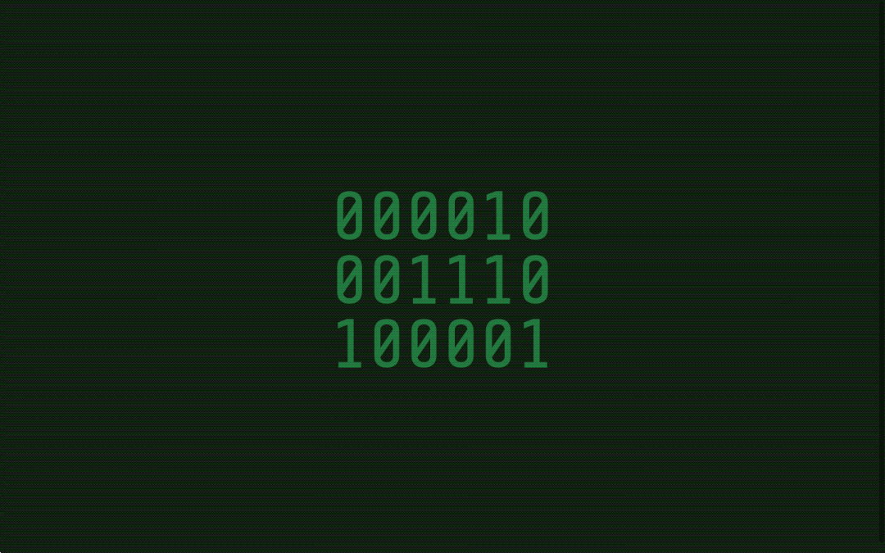

# Binary Clock

## Table of Contents

- [Description](#description)
- [Features](#features)
- [Demo](#demo)
- [Prerequisites](#prerequisites)
- [Installation](#installation)
- [Troubleshooting](#troubleshooting)
- [Contributing](#contributing)
- [Acknowledgments](#acknowledgments)
- [Contact](#contact)
- [Author](#author)

## Description

This project is a binary clock implemented using HTML, CSS, and JavaScript. It displays the current time in a binary format with a visually appealing design.

## Features

- Binary representation of hours, minutes, and seconds.
- Responsive design with font size adjustments based on screen height.

## Demo

Visit the live demo on [CodePen](https://codepen.io/karlhorning/pen/PBGLXj).

## Prerequisites

Make sure you have: 

- A web browser to view the project.

## Installation

To run this project locally, follow these steps:

1. Clone the repository: `git clone https://github.com/Karl-Horning/binary-clock.git`
2. Navigate to the project directory: `cd binary-clock`
3. Open `index.html` in your preferred web browser.

## Troubleshooting

- If you encounter any issues during installation or execution, please check the following:
  - Ensure that your web browser is up to date.

## Contributing

Contributions are welcome! Please follow these guidelines:

1. Fork the repository.
2. Create a new branch for your feature or bug fix.
3. Make your changes and ensure that the project still works.
4. Create a pull request with a clear description of your changes.

## Acknowledgments

- Special thanks to [Google Fonts](https://fonts.googleapis.com/css?family=Share+Tech+Mono) for providing the "Share Tech Mono" font used in this project.

## Contact

For any inquiries or support related to this project, please contact Karl Horning.

## Author

Karl Horning: [GitHub](https://github.com/Karl-Horning/) | [LinkedIn](https://www.linkedin.com/in/karl-horning/) | [CodePen](https://codepen.io/karlhorning)
